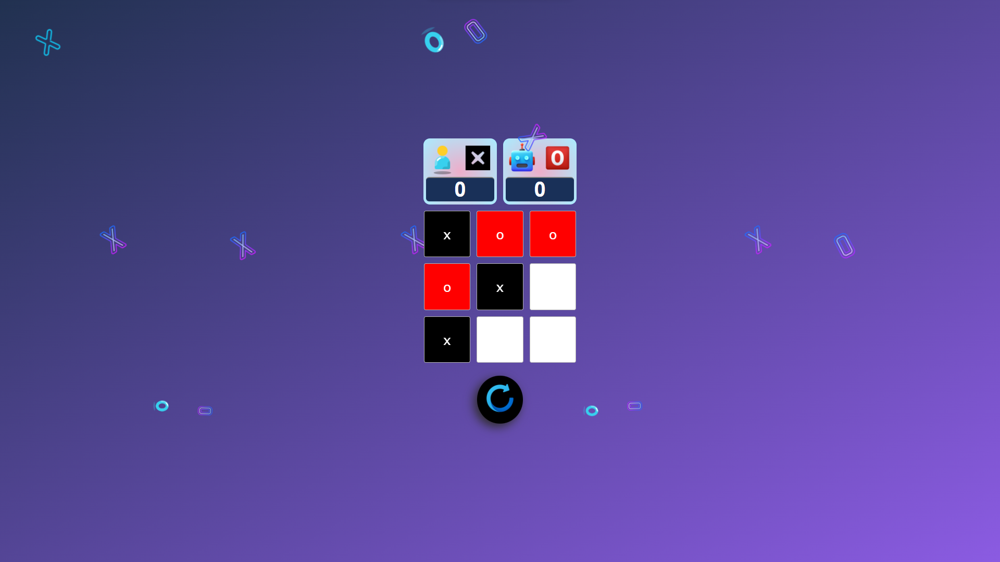
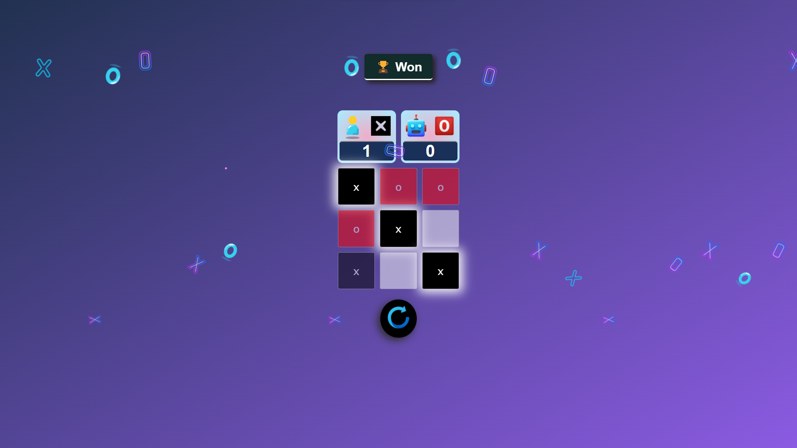
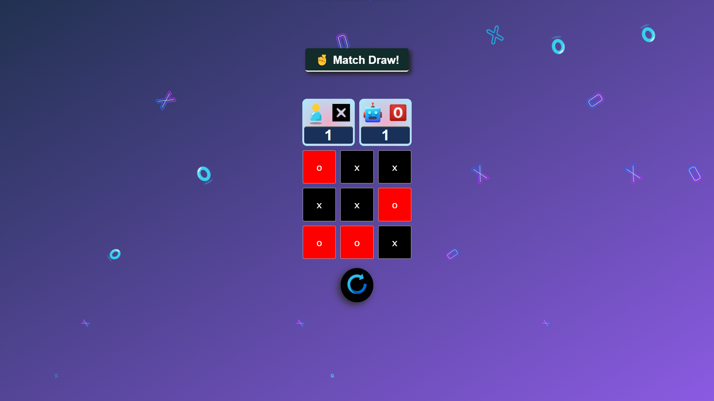
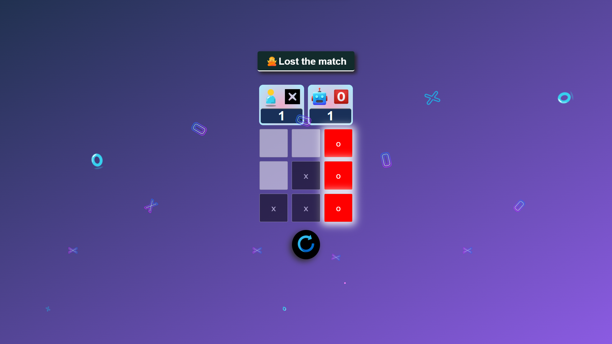

# Tic-Tac-Toe Game

Welcome to the Tic-Tac-Toe game repository! This simple game is built using HTML, CSS, and JavaScript, offering a classic gaming experience that you can enjoy directly from your web browser. The rules are straightforward: the first move is played by the user, who is assigned the symbol 'X'. The computer, represented by the symbol 'O', then makes its move. The objective is to place three marks in a vertical, horizontal, or diagonal row to win the game. If all the boxes are filled and no player has won, the game ends in a draw.

Enjoy the nostalgic fun of Tic-Tac-Toe and challenge yourself against the AI opponent! Feel free to reach out if you have any questions or feedback.

*[Play the Game](https://nithishgitsrc.github.io/Tic-tac-toe/)*

## How to Play
1. Access the game here: [Tic-Tac-Toe Game](https://nithishgitsrc.github.io/Tic-tac-toe/)

2.  **User's Move**: You start the game by clicking on an empty cell of the game board. Your assigned symbol 'X' will appear in that cell.

3. **Computer's Move**: After your move, the computer, represented by 'O', will automatically make its move. It will choose an available empty cell.

4. **Winning**: The game continues until one player forms a vertical, horizontal, or diagonal row of three symbols. When this happens, the winner is announced, and the game ends.

5. **Draw**: If all the cells are filled and no player has achieved a winning pattern, the game ends in a draw.

## Features
- Classic Tic-Tac-Toe gameplay.
- User-friendly interface for a seamless gaming experience.
- Responsive design for optimal gameplay on various devices.
- JavaScript-powered opponent (Symbol 'O') for single-player mode.

## ScreenShots

## Technologies Used

- HTML
- CSS
- JavaScript

## Future Enhancements

This project serves as a basic implementation of the classic Tic-Tac-Toe game. Here are a few ideas for future enhancements:

- Improved AI strategy for the computer's moves.
- Option to choose the player's symbol ('X' or 'O') at the beginning.
- Implementing additional game modes and difficulty levels.

## Contributions

Contributions are welcome! Feel free to fork this repository, make improvements, and create a pull request.

## License

This project is licensed under the [MIT License](LICENSE). Feel free to use, modify, and distribute the code as per the terms of the license.

Enjoy the game and have fun strategizing your moves! 🎮🤖🕹
